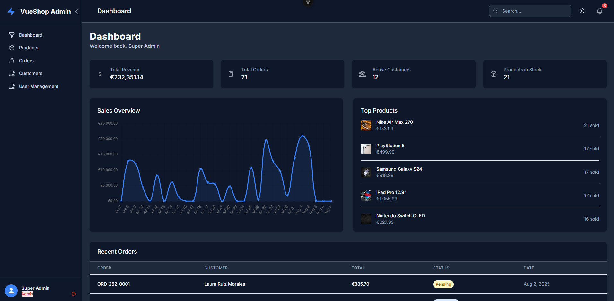
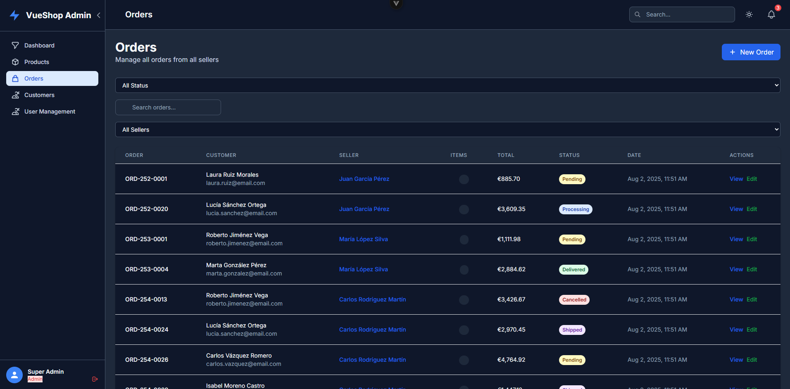
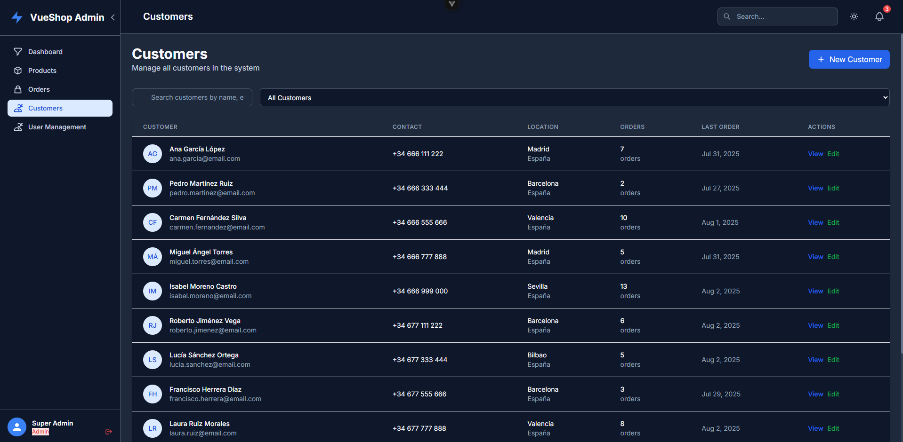
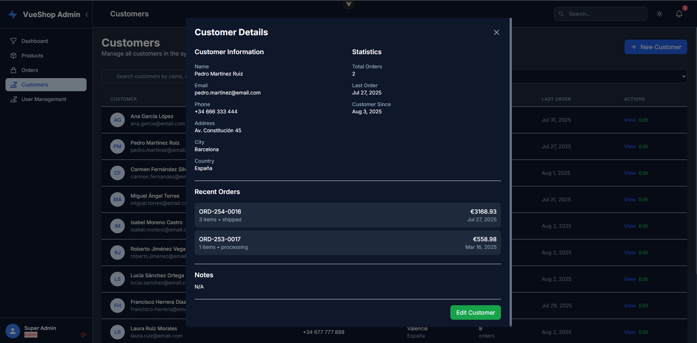

# 🛍️ VueShop Admin

VueShop Admin is a demo e-commerce administration dashboard built with **Vue 3**, **TypeScript**, **Tailwind CSS**, and **Laravel** (REST API + JWT Auth). It's a full-featured admin panel to manage users, customers, products, and orders with real-time data and dark mode support.

> ⚠️ This is a public portfolio project — not intended for production use.

---

## ✨ Features

- 🔐 JWT-based authentication with login, registration & session management
- 👤 User management with role-based access (Admin & Manager)
- 📦 CRUD for Products, Customers & Orders
- 📊 Dashboard with statistics & data overview
- 💡 Fully responsive design with dark mode
- 🧩 Modular structure & reusable components
- 📁 Backend built with Laravel + MySQL
- 🧪 Seeders for sample data (users, customers, products, orders)

---

## 🖼️ Screenshots

| Auth | Dashboard | Products |
|------|-----------|----------|
|  |  |  | 

---

## 🚀 Tech Stack

**Frontend:**
- Vue 3 + Vite
- TypeScript
- Tailwind CSS
- Pinia
- Axios

**Backend:**
- Laravel 10
- MySQL
- JWT Auth (Tymon)
- RESTful API

---

## 🛠️ Setup Instructions

> 🔧 You'll need **PHP ≥ 8.1**, **Composer**, **Node.js ≥ 18**, and **MySQL** installed.

### 1. Clone the repository

```bash
git clone https://github.com/AlvaroMillanEstevez/VueShop-Admin.git
cd vueshop-admin
```

### 2. Full setup script (optional)

If you want to set everything up in one go, you can use the script below:

<details>
<summary>📜 Click to expand <code>install.sh</code></summary>

```bash
#!/bin/bash

echo "🔧 Starting full VueShop Admin setup..."

# Backend setup
echo "📦 Installing Laravel backend..."
cd backend || exit

composer install
cp .env.example .env
php artisan key:generate
php artisan migrate --seed
php artisan serve &

# Frontend setup
cd ../frontend || exit

echo "🌐 Installing frontend dependencies..."
npm install
npm run dev
```

</details>

Give the script permission to execute:

```bash
chmod +x install.sh
./install.sh
```

### 3. Manual Setup (Alternative)

#### Backend (Laravel API)

```bash
cd backend
composer install
cp .env.example .env
php artisan key:generate
php artisan migrate --seed
php artisan serve
```

#### Frontend (Vue 3 + Vite)

```bash
cd frontend
npm install
npm run dev
```

---

## 🧪 Demo Users

After seeding:

| Role    | Email               | Password    |
|---------|---------------------|-------------|
| Admin   | admin@vueshop.com   | password123 |
| Manager | juan@vueshop.com    | password123 |
| Manager | maria@vueshop.com   | password123 |

---

## ⚙️ .env Configuration

`.env` files are excluded from the repository. Create them manually based on the examples below.

### 🔐 Laravel backend .env

```env
APP_NAME="VueShop Admin"
APP_ENV=local
APP_KEY=base64:your_app_key_here
APP_DEBUG=true
APP_URL=http://localhost

DB_CONNECTION=mysql
DB_HOST=127.0.0.1
DB_PORT=3306
DB_DATABASE=vueshop-admin
DB_USERNAME=root
DB_PASSWORD=

JWT_SECRET=your_jwt_secret
SANCTUM_STATEFUL_DOMAINS=localhost:5173

APP_LOCALE=en
LOG_CHANNEL=stack
SESSION_DRIVER=database
```

### 🌐 Frontend .env (frontend/.env)

```env
VITE_AUTH_CHECK=true
VITE_APP_DEBUG=true
```

---

## 📁 Project Structure

```
vueshop-admin/
├── backend/       ← Laravel API
├── frontend/      ← Vue 3 + Vite app
├── install.sh     ← Setup script
├── README.md
```

---

## 📝 Notes

- This is a public demo project — some buttons and features are intentionally incomplete.
- It's designed for portfolio purposes to showcase clean architecture, modern stack, and good UI/UX.
- Future improvements may include file upload, payment integration, advanced permissions, etc.

---

## 📬 Contact

- **Portfolio:** [Alvaro Millan Estevez](https://alvaromillanestevez.github.io)
- **LinkedIn:** [https://www.linkedin.com/in/alvaro-millan-estevez-27b814375/](https://www.linkedin.com/in/alvaro-millan-estevez-27b814375/)

---

## 🧾 License

MIT License

Permission is hereby granted, free of charge, to any person obtaining a copy of this software and associated documentation files (the "Software"), to deal in the Software without restriction, including without limitation the rights to use, copy, modify, merge, publish, distribute, sublicense, and/or sell copies of the Software, and to permit persons to whom the Software is furnished to do so, subject to the following conditions:

The above copyright notice and this permission notice shall be included in all copies or substantial portions of the Software.

THE SOFTWARE IS PROVIDED "AS IS", WITHOUT WARRANTY OF ANY KIND, EXPRESS OR IMPLIED, INCLUDING BUT NOT LIMITED TO THE WARRANTIES OF MERCHANTABILITY, FITNESS FOR A PARTICULAR PURPOSE AND NONINFRINGEMENT. IN NO EVENT SHALL THE AUTHORS OR COPYRIGHT HOLDERS BE LIABLE FOR ANY CLAIM, DAMAGES OR OTHER LIABILITY, WHETHER IN AN ACTION OF CONTRACT, TORT OR OTHERWISE, ARISING FROM, OUT OF OR IN CONNECTION WITH THE SOFTWARE OR THE USE OR OTHER DEALINGS IN THE SOFTWARE.